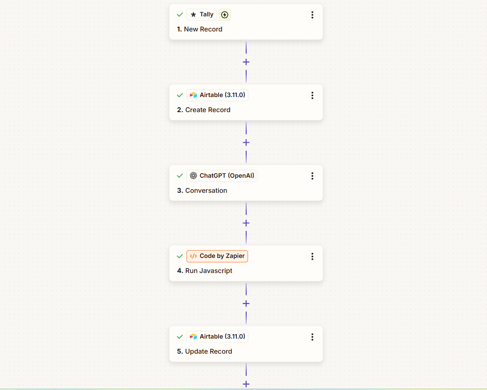
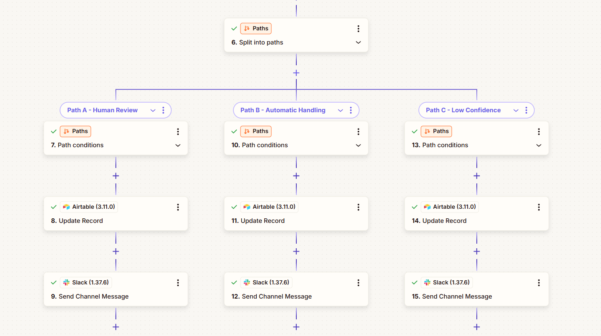
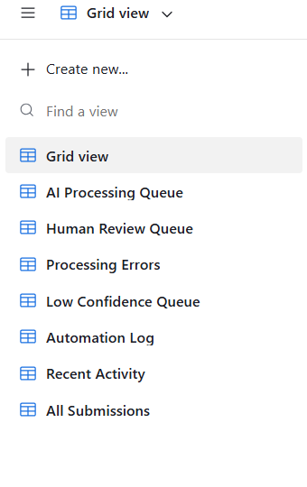
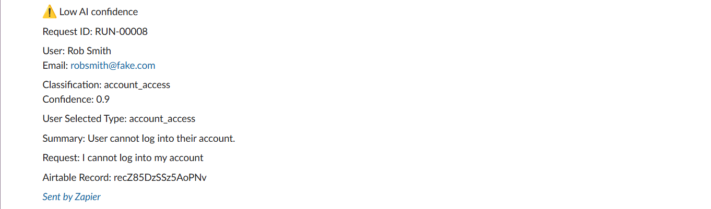
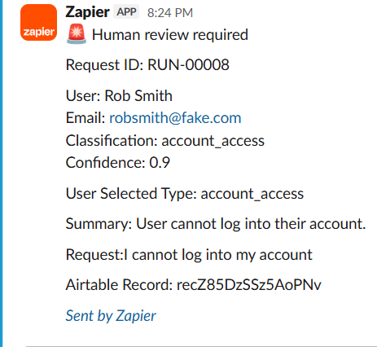
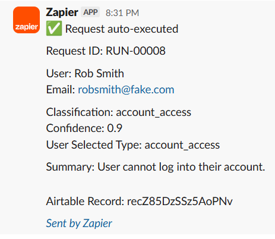

# AI Intake & Triage Automation System

An AI-powered workflow that automatically classifies inbound requests, routes them through automation pipelines, and escalates low-confidence cases for human review.

## System Overview

This project demonstrates an **AI-powered intake and triage system** designed to automatically process inbound requests, classify them using an LLM, and route them to the appropriate workflow.

The system simulates a real operational environment where incoming requests must be:

• analyzed by AI  
• structured into machine-readable data  
• routed based on confidence scores  
• escalated to humans when necessary  

The architecture combines **AI classification with workflow automation** to create a scalable request-handling pipeline.

---

## Problem

Organizations receive large volumes of inbound requests from customers, employees, or partners.

Manually reviewing and routing these requests creates several problems:

• slow response times  
• inconsistent categorization  
• human error  
• lack of operational visibility  

A scalable system needs to automatically analyze requests and route them intelligently.

---

## Solution

This system uses an AI classification pipeline combined with automation tools.

The workflow:

1. Users submit a request through an intake form  
2. The request is stored in Airtable  
3. An LLM analyzes the request and generates structured output  
4. The system calculates a confidence score  
5. Requests are routed to one of three paths:

• **Auto Execute** – handled automatically  
• **Human Review** – escalated to Slack  
• **Low Confidence** – flagged for investigation  

---

## Key Capabilities

• AI-powered request classification  
• structured JSON outputs from LLMs  
• human-in-the-loop automation  
• operational monitoring through Airtable views  
• Slack alerting for escalations  

---

## Tech Stack

• OpenAI / ChatGPT  
• Zapier automation workflows  
• Airtable data storage  
• Slack notifications  
• Tally intake forms

---

# System Architecture


---

## Automation Workflow

The AI intake pipeline is orchestrated using Zapier and routes requests based on AI confidence scores.

### Zapier Workflow






---

---

# Data Model

Key fields stored in Airtable:

| Field                 | Purpose                |
| --------------------- | ---------------------- |
| user_name             | request submitter      |
| user_email            | contact email          |
| input_text            | request description    |
| user_request_type_raw | user selected category |
| classification        | AI classification      |
| summary               | AI generated summary   |
| confidence            | AI confidence score    |
| recommended_action    | automation decision    |
| requires_human_review | escalation flag        |
| AI Processed          | queue control          |


---

## Operational Views

Operational views track the AI processing pipeline and escalation queues.



---

## Slack Notifications

The system automatically alerts operators when requests require human review or fall below confidence thresholds.

### Human Review Alert



### Low Confidence Alert



### Auto Execution Notification



---

# Example AI Output

The system converts natural language requests into structured data.

Example:

```
json

{
  "classification": "billing",
  "summary": "Customer reports duplicate charge.",
  "confidence": 0.91,
  "recommended_action": "human_review",
  "requires_human_review": true
}

This allows automation workflows to operate on structured information rather than raw text.

# Key Features

AI Request Classification

Incoming requests are categorized into structured types such as:
- billing_issue
- technical_issue
- sales_inquiry
- feature_request
- refund_request
- security_issue

Human-in-the-Loop Workflow

Requests requiring manual attention are automatically escalated when:
- AI confidence is low
- the issue involves billing disputes
- the request contains complaints
- security issues are detected

These cases are sent to Slack for manual review.

Automated Routing

Requests with high confidence can be handled automatically.

Examples include:

- routing sales inquiries
- logging support issues
- triggering downstream workflows

Operational Monitoring

The system includes monitoring views in Airtable such as:
- AI Processing Queue
- Human Review Queue
- Low Confidence Queue
- Automation Log
- Processing Errors

---

# Example Workflow

User submits request:
"I was charged twice for my subscription this month."

AI classification:
- classification: billing
- confidence: 0.91
- recommended_action: human_review

System action:
- Slack notification → Human Review Queue

---

# Why This Project Matters

This project demonstrates how AI systems can be integrated into operational workflows.

It showcases:
- AI workflow automation
- structured LLM outputs
- human-in-the-loop AI systems
- automation orchestration
- operational monitoring

These capabilities are essential for deploying AI in production environments.

---

# Future Extensions

Planned extensions include:
- AI Operations Analytics Dashboard
- Document Processing Pipeline
- Lead Qualification Automation
- Knowledge Retrieval System

These additional systems will build on the same infrastructure layer.

---

# Author

Dennis Hanton | AI Automation & Workflow Engineering
