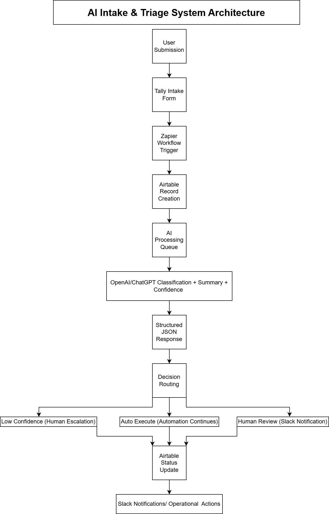
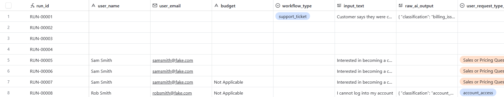
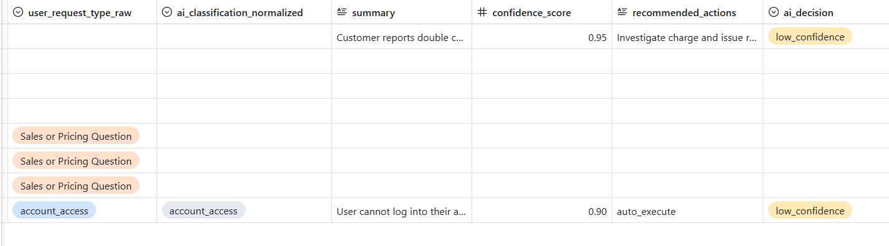
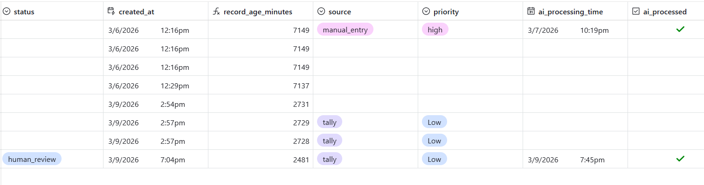
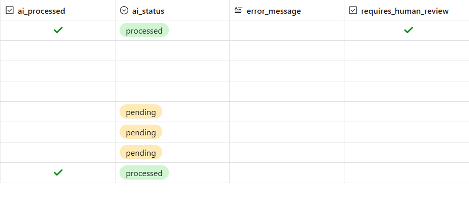

# AI Intake & Triage Automation System

An AI-powered workflow that converts unstructured requests into structured decisions and automated actions.

This system automatically classifies inbound requests, determines whether they require human review, and routes them through an operational workflow.

---

# Problem

Organizations receive a large number of inbound requests such as:

- billing questions
- support issues
- feature requests
- sales inquiries

These requests typically arrive as **unstructured text**, requiring manual triage before action can be taken.

Manual triage creates several problems:

- slow response times
- inconsistent routing
- operational inefficiencies
- difficulty scaling support workflows

---

# Solution

This project implements an **AI-powered triage system** that automatically:

1. Captures inbound requests through a form
2. Uses an LLM to classify the request
3. Generates structured JSON output
4. Routes the request based on AI confidence
5. Escalates uncertain cases to human reviewers
6. Logs activity for operational monitoring

---

# System Architecture



---

# Example AI Output

The system converts natural language requests into structured data.

Example:

```
json

{
  "classification": "billing",
  "summary": "Customer reports duplicate charge.",
  "confidence": 0.91,
  "recommended_action": "human_review",
  "requires_human_review": true
}

This allows automation workflows to operate on structured information rather than raw text.

# Key Features

AI Request Classification

Incoming requests are categorized into structured types such as:
- billing_issue
- technical_issue
- sales_inquiry
- feature_request
- refund_request
- security_issue

Human-in-the-Loop Workflow

Requests requiring manual attention are automatically escalated when:
- AI confidence is low
- the issue involves billing disputes
- the request contains complaints
- security issues are detected

These cases are sent to Slack for manual review.

Automated Routing

Requests with high confidence can be handled automatically.

Examples include:

- routing sales inquiries
- logging support issues
- triggering downstream workflows

Operational Monitoring

The system includes monitoring views in Airtable such as:
- AI Processing Queue
- Human Review Queue
- Low Confidence Queue
- Automation Log
- Processing Errors

---

# Tech Stack

Automation:
- Zapier
- AI
- OpenAI / ChatGPT

Data Storage:
- Airtable

Notifications:
- Slack

Data Format:
- JSON

---

# Example Workflow

User submits request:
"I was charged twice for my subscription this month."

AI classification:
- classification: billing
- confidence: 0.91
- recommended_action: human_review

System action:
- Slack notification → Human Review Queue

---

# Automation Workflow

The automation pipeline is orchestrated using Zapier.  
It handles form triggers, AI processing, decision routing, and notifications.

### Workflow Overview


---

# Data Model

Key fields stored in Airtable:

| Field                 | Purpose                |
| --------------------- | ---------------------- |
| user_name             | request submitter      |
| user_email            | contact email          |
| input_text            | request description    |
| user_request_type_raw | user selected category |
| classification        | AI classification      |
| summary               | AI generated summary   |
| confidence            | AI confidence score    |
| recommended_action    | automation decision    |
| requires_human_review | escalation flag        |
| AI Processed          | queue control          |









---

# Operational Monitoring

The system includes operational views that track request processing.

Examples include:

- AI Processing Queue
- Human Review Queue
- Low Confidence Queue
- Automation Logs


---

# Slack Notifications

When requests require human review or have low confidence scores, the system sends Slack alerts.


---

# Why This Project Matters

This project demonstrates how AI systems can be integrated into operational workflows.

It showcases:
- AI workflow automation
- structured LLM outputs
- human-in-the-loop AI systems
- automation orchestration
- operational monitoring

These capabilities are essential for deploying AI in production environments.

---

# Future Extensions

Planned extensions include:
- AI Operations Analytics Dashboard
- Document Processing Pipeline
- Lead Qualification Automation
- Knowledge Retrieval System

These additional systems will build on the same infrastructure layer.

---

# Author

Dennis Hanton | AI Automation & Workflow Engineering
